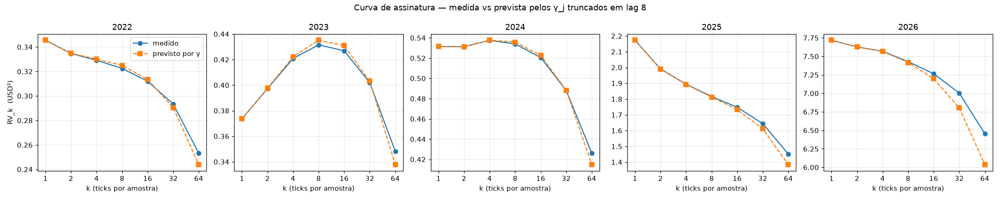

# Dependência em escala de tick — XAUUSD bid sobre `data/raw/`

> Gerado por `research/audit_tickdep.py`. Nenhum número aqui é estimativa.

| Campo | Valor |
|---|---|
| Commit | `fbe8ce4` |
| Máscara: `REOPEN_SUMMER` | 1320 min (22:00) |
| Máscara: `SUNDAY_OPEN_SUMMER` | 1321 min (22:01) |
| Máscara: `WINTER_SHIFT_MIN` | 60 min |
| Ticks lidos | 240,344,662 |
| Removidos por feriado | 32,239 |
| Removidos fora de sessão | 180,408 |
| Barras M1 | 1,402,473 |
| Barras com n ≥ 128 | 738,133 (52.6%) |
| Bootstrap | 1000 reamostragens, blocos de um dia |
| Tempo | 2860 s |
| Pico de memória | 3975 MB |

A máscara já esteve errada três vezes. As constantes acima existem para que,
quando ela mudar a quarta, dê para saber se estes números precisam ser regerados.

---

## Critério 2 — reprodução do piloto de 2026-06

| Grandeza | Medido | Piloto | Diferença |
|---|---|---|---|
| `E[rv²]` intra-minuto | 3.8409 | 3.8409 | +0.00% |
| `ρ₁` | +0.01241 | +0.01230 | +0.88% |

**Piloto reproduzido.**

A diferença em `ρ₁` é esperada e tem causa conhecida: o piloto usou
`pandas.Series.autocorr`, que remove a média e não exclui os pares que cruzam a
fronteira do minuto. Este módulo exclui, e não remove média — ver a docstring de
`microstructure.py` para o porquê.

---

## Resultado principal — `γ_j` por estrato

A pergunta da sessão se responde olhando se `γ_j` para `j ≥ 2` é distinguível de
zero. Não por limiar: por erro-padrão.

### `ano_2022`

| lag | γ_j | erro-padrão | γ_j/γ₀ | \|t\| |
|---|---|---|---|---|
| 0 | +1.497e-03 | 7.917e-05 | +1.00000 | 18.9 |
| 1 | -4.017e-05 | 1.492e-05 | -0.02684 | 2.7 |
| 2 | +1.273e-05 | 8.872e-06 | +0.00851 | 1.4 |
| 3 | -2.977e-07 | 4.831e-06 | -0.00020 | 0.1 |
| 4 | +1.270e-06 | 4.199e-06 | +0.00085 | 0.3 |
| 5 | +1.652e-06 | 2.331e-06 | +0.00110 | 0.7 |
| 6 | +5.635e-06 | 2.712e-06 | +0.00376 | 2.1 |
| 7 | +2.603e-06 | 2.199e-06 | +0.00174 | 1.2 |
| 8 | -5.013e-06 | 4.844e-06 | -0.00335 | 1.0 |

### `ano_2023`

| lag | γ_j | erro-padrão | γ_j/γ₀ | \|t\| |
|---|---|---|---|---|
| 0 | +1.684e-03 | 5.249e-05 | +1.00000 | 32.1 |
| 1 | +1.160e-04 | 5.293e-06 | +0.06892 | 21.9 |
| 2 | +6.126e-05 | 5.179e-06 | +0.03638 | 11.8 |
| 3 | +1.853e-05 | 3.325e-06 | +0.01101 | 5.6 |
| 4 | +1.170e-05 | 1.860e-06 | +0.00695 | 6.3 |
| 5 | +9.227e-06 | 3.383e-06 | +0.00548 | 2.7 |
| 6 | +5.578e-06 | 2.040e-06 | +0.00331 | 2.7 |
| 7 | +4.965e-06 | 1.690e-06 | +0.00295 | 2.9 |
| 8 | +9.242e-07 | 2.041e-06 | +0.00055 | 0.5 |

### `ano_2024`

| lag | γ_j | erro-padrão | γ_j/γ₀ | \|t\| |
|---|---|---|---|---|
| 0 | +2.203e-03 | 8.576e-05 | +1.00000 | 25.7 |
| 1 | +8.137e-06 | 2.847e-05 | +0.00369 | 0.3 |
| 2 | +4.255e-05 | 4.348e-06 | +0.01932 | 9.8 |
| 3 | -1.332e-06 | 3.865e-06 | -0.00060 | 0.3 |
| 4 | +5.212e-06 | 2.021e-06 | +0.00237 | 2.6 |
| 5 | -8.513e-07 | 2.198e-06 | -0.00039 | 0.4 |
| 6 | +5.233e-06 | 2.025e-06 | +0.00238 | 2.6 |
| 7 | +4.712e-06 | 2.533e-06 | +0.00214 | 1.9 |
| 8 | +1.625e-06 | 3.483e-06 | +0.00074 | 0.5 |

### `ano_2025`

| lag | γ_j | erro-padrão | γ_j/γ₀ | \|t\| |
|---|---|---|---|---|
| 0 | +8.250e-03 | 6.897e-04 | +1.00000 | 12.0 |
| 1 | -6.657e-04 | 2.869e-04 | -0.08069 | 2.3 |
| 2 | +6.336e-05 | 4.818e-05 | +0.00768 | 1.3 |
| 3 | -9.264e-05 | 3.592e-05 | -0.01123 | 2.6 |
| 4 | +6.452e-06 | 4.806e-06 | +0.00078 | 1.3 |
| 5 | -1.217e-05 | 7.575e-06 | -0.00148 | 1.6 |
| 6 | +1.121e-05 | 9.821e-06 | +0.00136 | 1.1 |
| 7 | +4.039e-06 | 5.207e-06 | +0.00049 | 0.8 |
| 8 | +4.382e-06 | 5.693e-06 | +0.00053 | 0.8 |

### `ano_2026`

| lag | γ_j | erro-padrão | γ_j/γ₀ | \|t\| |
|---|---|---|---|---|
| 0 | +2.430e-02 | 2.975e-03 | +1.00000 | 8.2 |
| 1 | -2.126e-04 | 1.466e-04 | -0.00875 | 1.5 |
| 2 | +1.326e-04 | 4.837e-05 | +0.00545 | 2.7 |
| 3 | -1.258e-04 | 2.255e-05 | -0.00518 | 5.6 |
| 4 | -5.763e-05 | 1.696e-05 | -0.00237 | 3.4 |
| 5 | -4.542e-05 | 1.529e-05 | -0.00187 | 3.0 |
| 6 | +3.585e-06 | 1.591e-05 | +0.00015 | 0.2 |
| 7 | -1.017e-05 | 1.022e-05 | -0.00042 | 1.0 |
| 8 | +1.008e-05 | 1.114e-05 | +0.00041 | 0.9 |

### `domingo`

| lag | γ_j | erro-padrão | γ_j/γ₀ | \|t\| |
|---|---|---|---|---|
| 0 | +6.474e-02 | 1.147e-02 | +1.00000 | 5.6 |
| 1 | -1.095e-02 | 2.937e-03 | -0.16917 | 3.7 |
| 2 | -2.913e-04 | 5.274e-04 | -0.00450 | 0.6 |
| 3 | -8.398e-04 | 4.714e-04 | -0.01297 | 1.8 |
| 4 | -1.066e-07 | 2.956e-04 | -0.00000 | 0.0 |
| 5 | +1.736e-05 | 3.052e-04 | +0.00027 | 0.1 |
| 6 | -3.434e-04 | 1.976e-04 | -0.00530 | 1.7 |
| 7 | +6.250e-04 | 3.033e-04 | +0.00966 | 2.1 |
| 8 | -4.492e-04 | 2.660e-04 | -0.00694 | 1.7 |

## Curva de assinatura — medida contra prevista

A previsão usa `E[RV_k] = (n−k)·γ₀ + (2(n−k)/k)·Σ(k−j)·γ_j`, com os `γ_j`
medidos acima e **truncados no lag 8**. Para `k ≤ 9` a previsão é exata dado o
modelo; para `k` maior ela assume `γ_j = 0` acima do lag 8.

**É essa truncagem que a curva testa.** Divergência crescente com `k` significa
dependência além do lag 8 — ou covariância não estacionária dentro do minuto.

**A forma normalizada em `k=1` e o que responde a pergunta.** O nivel absoluto
depende de `Cov(n, γ₀)` — minutos movimentados sao mais volateis — e nao da
estrutura de dependencia. As duas ultimas colunas isolam a forma.

| Estrato | k | n medio | RV medido | RV previsto | erro nivel | forma medida | forma prevista | erro forma |
|---|---|---|---|---|---|---|---|---|
| ano_2022 | 1 | 232 | 0.3455 | 0.3455 | -0.0% | 1.0000 | 1.0000 | **+0.00%** |
| ano_2022 | 2 | 232 | 0.3347 | 0.3348 | -0.0% | 0.9686 | 0.9689 | **-0.04%** |
| ano_2022 | 4 | 232 | 0.3292 | 0.3302 | -0.3% | 0.9526 | 0.9556 | **-0.31%** |
| ano_2022 | 8 | 232 | 0.3225 | 0.3249 | -0.7% | 0.9333 | 0.9401 | **-0.73%** |
| ano_2022 | 16 | 232 | 0.3120 | 0.3135 | -0.5% | 0.9028 | 0.9073 | **-0.49%** |
| ano_2022 | 32 | 232 | 0.2933 | 0.2904 | +1.0% | 0.8489 | 0.8404 | **+1.02%** |
| ano_2022 | 64 | 232 | 0.2532 | 0.2439 | +3.8% | 0.7327 | 0.7060 | **+3.79%** |
| ano_2023 | 1 | 223 | 0.3737 | 0.3737 | -0.0% | 1.0000 | 1.0000 | **+0.00%** |
| ano_2023 | 2 | 223 | 0.3973 | 0.3976 | -0.1% | 1.0633 | 1.0641 | **-0.08%** |
| ano_2023 | 4 | 223 | 0.4209 | 0.4222 | -0.3% | 1.1263 | 1.1298 | **-0.31%** |
| ano_2023 | 8 | 223 | 0.4315 | 0.4351 | -0.8% | 1.1548 | 1.1645 | **-0.83%** |
| ano_2023 | 16 | 223 | 0.4269 | 0.4309 | -0.9% | 1.1424 | 1.1532 | **-0.94%** |
| ano_2023 | 32 | 223 | 0.4019 | 0.4031 | -0.3% | 1.0756 | 1.0788 | **-0.29%** |
| ano_2023 | 64 | 223 | 0.3482 | 0.3379 | +3.1% | 0.9317 | 0.9041 | **+3.05%** |
| ano_2024 | 1 | 242 | 0.5314 | 0.5314 | -0.0% | 1.0000 | 1.0000 | **+0.00%** |
| ano_2024 | 2 | 242 | 0.5313 | 0.5312 | +0.0% | 0.9998 | 0.9995 | **+0.02%** |
| ano_2024 | 4 | 242 | 0.5376 | 0.5377 | -0.0% | 1.0116 | 1.0118 | **-0.02%** |
| ano_2024 | 8 | 242 | 0.5341 | 0.5359 | -0.3% | 1.0050 | 1.0084 | **-0.33%** |
| ano_2024 | 16 | 242 | 0.5206 | 0.5228 | -0.4% | 0.9796 | 0.9837 | **-0.41%** |
| ano_2024 | 32 | 242 | 0.4879 | 0.4882 | -0.1% | 0.9181 | 0.9186 | **-0.05%** |
| ano_2024 | 64 | 242 | 0.4261 | 0.4149 | +2.7% | 0.8017 | 0.7808 | **+2.69%** |
| ano_2025 | 1 | 264 | 2.1730 | 2.1730 | +0.0% | 1.0000 | 1.0000 | **+0.00%** |
| ano_2025 | 2 | 264 | 1.9906 | 1.9901 | +0.0% | 0.9160 | 0.9158 | **+0.02%** |
| ano_2025 | 4 | 264 | 1.8941 | 1.8927 | +0.1% | 0.8716 | 0.8710 | **+0.07%** |
| ano_2025 | 8 | 264 | 1.8155 | 1.8123 | +0.2% | 0.8355 | 0.8340 | **+0.18%** |
| ano_2025 | 16 | 264 | 1.7480 | 1.7333 | +0.8% | 0.8044 | 0.7977 | **+0.84%** |
| ano_2025 | 32 | 264 | 1.6442 | 1.6112 | +2.0% | 0.7566 | 0.7414 | **+2.05%** |
| ano_2025 | 64 | 264 | 1.4515 | 1.3848 | +4.8% | 0.6680 | 0.6373 | **+4.82%** |
| ano_2026 | 1 | 319 | 7.7184 | 7.7184 | +0.0% | 1.0000 | 1.0000 | **+0.00%** |
| ano_2026 | 2 | 319 | 7.6272 | 7.6269 | +0.0% | 0.9882 | 0.9881 | **+0.00%** |
| ano_2026 | 4 | 319 | 7.5693 | 7.5672 | +0.0% | 0.9807 | 0.9804 | **+0.03%** |
| ano_2026 | 8 | 319 | 7.4291 | 7.4170 | +0.2% | 0.9625 | 0.9609 | **+0.16%** |
| ano_2026 | 16 | 319 | 7.2645 | 7.1975 | +0.9% | 0.9412 | 0.9325 | **+0.93%** |
| ano_2026 | 32 | 319 | 7.0039 | 6.8035 | +2.9% | 0.9074 | 0.8815 | **+2.95%** |
| ano_2026 | 64 | 319 | 6.4544 | 6.0378 | +6.9% | 0.8362 | 0.7823 | **+6.90%** |
| domingo | 1 | 240 | 15.4782 | 15.4782 | +0.0% | 1.0000 | 1.0000 | **+0.00%** |
| domingo | 2 | 240 | 12.8181 | 12.8060 | +0.1% | 0.8281 | 0.8274 | **+0.09%** |
| domingo | 4 | 240 | 11.2688 | 11.2378 | +0.3% | 0.7280 | 0.7260 | **+0.28%** |
| domingo | 8 | 240 | 10.2751 | 10.2314 | +0.4% | 0.6638 | 0.6610 | **+0.43%** |
| domingo | 16 | 240 | 9.6042 | 9.4517 | +1.6% | 0.6205 | 0.6106 | **+1.61%** |
| domingo | 32 | 240 | 8.8862 | 8.5786 | +3.6% | 0.5741 | 0.5542 | **+3.59%** |
| domingo | 64 | 240 | 7.6994 | 7.1755 | +7.3% | 0.4974 | 0.4636 | **+7.30%** |

---

## Critério 5 — gap de fronteira

O `rv` do ADR 0005 inclui o retorno que atravessa a fronteira do minuto; o piloto
mediu só o intra-minuto. A diferença é o span faltante, e o brief prevê um gap
médio de ~1,3 s a partir da decomposição do déficit de 4,61%.

| Grandeza | Valor |
|---|---|
| Gap de fronteira, média | 2.206 s |
| Gap de fronteira, mediana | 0.821 s |
| Gap de fronteira, p95 | 8.879 s |
| Intervalo médio entre ticks, `60/n` | 0.444 s |
| Razão gap ÷ intervalo médio | 4.96 |
| Previsto pelo brief | ~1,3 s |

| `E[rv²]` intra-minuto (todas as barras) | 1.5602 |
| `E[rv²]` ADR 0005, com fronteira | 1.6001 |
| Acréscimo da fronteira | +2.55% |

---

## Bids repetidos

| Grandeza | Valor |
|---|---|
| Ticks | 240,132,015 |
| Retornos | 238,729,542 |
| Retornos com bid alterado | 188,775,847 |
| **Fração de retornos exatamente zero** | **20.9%** |

### Por estrato

| Estrato | ticks (mediana) | mudanças (mediana) | retornos zero |
|---|---|---|---|
| ano_2022 | 198 | 141 | 28.2% |
| ano_2023 | 187 | 147 | 21.2% |
| ano_2024 | 208 | 146 | 29.1% |
| ano_2025 | 229 | 183 | 19.3% |
| ano_2026 | 279 | 242 | 12.5% |
| domingo | 205 | 165 | 18.3% |

### Qual eixo descreve a escala da dependência

Critério 6 do brief. `ρ₁ = γ₁/γ₀` por quartil, em cada eixo. A dependência
**escala com** o eixo em que `ρ₁` varia mais entre quartis; o eixo em que ela fica
plana não é o que a governa.

| Eixo | q1 | q2 | q3 | q4 | amplitude |
|---|---|---|---|---|---|
| `n_ticks` | -0.0229 | -0.0139 | +0.0030 | -0.0091 | **0.0259** |
| `n_changes` | -0.0321 | -0.0106 | +0.0002 | -0.0081 | **0.0323** |

Veredicto: **indistinguível** — as amplitudes ficam a menos de 1,5× uma da outra, e os dois eixos são quase colineares.

Ressalva: os dois eixos são fortemente correlacionados por construção — mais ticks
implicam mais mudanças. Amplitudes próximas não significam que a escolha é
indiferente, apenas que **estes dados não separam os dois**.

Retorno exatamente zero viola ruído iid por construção: o erro de cotação é o
mesmo em dois ticks seguidos. E interage com `tick_imb`, que pelo ADR 0005
*repete o sinal anterior se igual* — nessa fração dos ticks o sinal é copiado, o
que é injeção mecânica de autocorrelação numa primitiva que `bars/` vai congelar.

---

## Densidade de tick

Fecha a lacuna "Densidade de tick por sessão" da seção 8 do
`REFERENCIA-XAUUSD.md`.

| Sessão | Barras | p05 | mediana | p95 | mudanças (mediana) | abaixo de 128 |
|---|---|---|---|---|---|---|
| Asiático | 429,921 | 25 | 106 | 360 | 79 | 251,608 |
| Londres | 306,928 | 42 | 140 | 336 | 102 | 134,897 |
| Nova York | 300,846 | 26 | 133 | 423 | 96 | 143,568 |
| Sobreposição LDN/NY | 245,335 | 86 | 277 | 597 | 213 | 30,741 |
| fora | 119,443 | 9 | 43 | 219 | 30 | 103,526 |

| Hora UTC | Barras | p05 | mediana | p95 | abaixo de 128 |
|---|---|---|---|---|---|
| 00 | 61,420 | 23 | 86 | 326 | 42,391 |
| 01 | 61,259 | 46 | 159 | 474 | 23,882 |
| 02 | 61,440 | 32 | 117 | 373 | 33,270 |
| 03 | 61,317 | 22 | 91 | 313 | 40,024 |
| 04 | 61,489 | 16 | 68 | 230 | 48,255 |
| 05 | 61,496 | 25 | 101 | 342 | 37,607 |
| 06 | 61,500 | 40 | 145 | 362 | 26,179 |
| 07 | 61,452 | 50 | 152 | 347 | 23,255 |
| 08 | 60,886 | 50 | 154 | 357 | 22,398 |
| 09 | 61,617 | 42 | 135 | 328 | 28,431 |
| 10 | 61,534 | 36 | 124 | 307 | 31,967 |
| 11 | 61,439 | 39 | 133 | 334 | 28,846 |
| 12 | 61,260 | 59 | 203 | 513 | 15,275 |
| 13 | 61,379 | 112 | 318 | 614 | 4,417 |
| 14 | 61,557 | 122 | 335 | 632 | 3,456 |
| 15 | 61,139 | 88 | 262 | 579 | 7,593 |
| 16 | 61,377 | 56 | 185 | 480 | 17,036 |
| 17 | 61,298 | 40 | 155 | 426 | 23,603 |
| 18 | 60,772 | 33 | 132 | 422 | 29,202 |
| 19 | 59,413 | 30 | 129 | 406 | 29,403 |
| 20 | 57,986 | 14 | 67 | 323 | 44,324 |
| 21 | 19,162 | 9 | 44 | 193 | 16,960 |
| 22 | 39,609 | 7 | 39 | 220 | 34,365 |
| 23 | 60,672 | 9 | 44 | 224 | 52,201 |

---

## Ressalvas

- **Este relatório não conclui sobre `η`.** O que se mede é a dependência
  **líquida**: momento em escala de tick entra positivo, quique de cotação entra
  negativo, e os dois não são separáveis com série de bid apenas. Nada aqui deve
  ser lido como estimativa de ruído de cotação nem de spread efetivo.
- **Faixas de sanidade são relato, nunca suspeita.** Nenhum número foi descartado
  nem "corrigido" por estar fora do esperado.
- **`γ_j` não remove média.** A média dos retornos de tick é de ordem `s²/n`;
  removê-la nesta escala introduz mais viés do que corrige.
- **A previsão da curva trunca no lag 8.** Para `k ∈ {16, 32, 64}` ela assume
  ausência de dependência acima disso, e a divergência observada é o teste dessa
  suposição — não um erro do ajuste.
- **`raw/` é Dukascopy, não o broker.** O caminho de preço transplanta; a densidade
  de tick é parcial e o spread não transplanta (`REFERENCIA-XAUUSD.md` seção 4).
