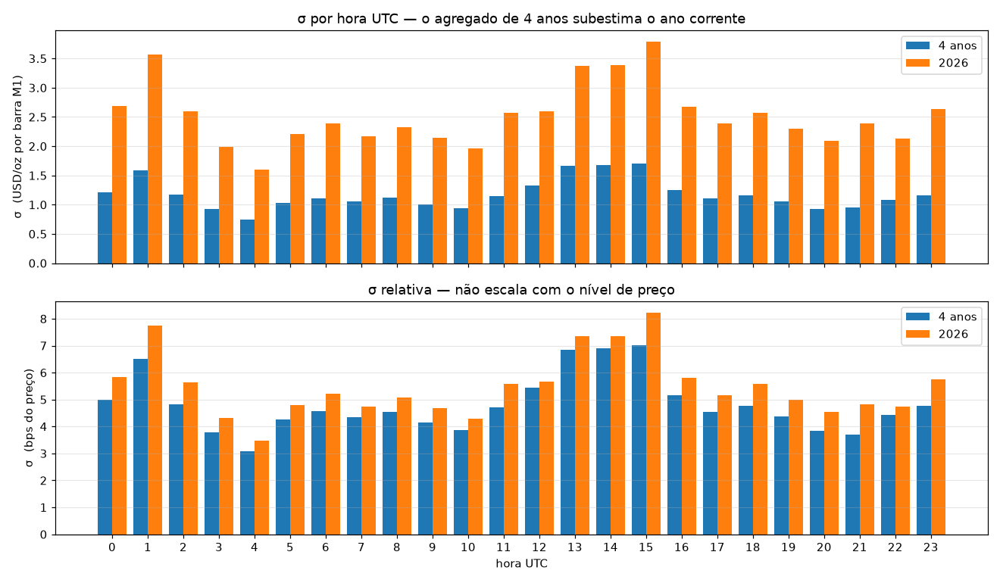

# Auditoria de σ — XAUUSD M1 sobre `data/raw/`

> Gerado por `research/audit_sigma.py` sobre os quatro anos de tick real.
> Substitui as estimativas preliminares do `CLAUDE.md` §13.2 (item 5 da §18).
> Nenhum número aqui é estimativa — todos saíram da leitura do dado.

## O que foi medido

σ é o **desvio-padrão da variação de preço em uma barra M1, em USD/oz**, sobre o bid.
É a definição que a §13.2 usa em `R alcançável ≈ σ√T`; invertendo, o tempo para
alcançar `R` é `T = (R/σ)²`. Portanto a medição é diretamente comparável à estimativa.

| Etapa | Ticks |
|---|---|
| Lidos de `raw/` | 240,344,662 |
| Removidos por feriado (ADR 0006) | 32,239 |
| Removidos por estar fora da sessão (§10.6) | 386,246 |

Barras M1 resultantes: **1,400,905**. Variações entre minutos adjacentes: **1,399,354**. Pares descartados por não serem consecutivos: 1,550 — são as bordas da parada diária e dos fins de semana, onde a diferença de preço não é uma variação de um minuto.

---

## O resultado que importa

### Ano corrente (2026) — é este que deve alimentar a §13.2

| Sessão | Horas UTC | Barras | σ medida | σ robusta | Estimativa §13.2 | Medido/Estimado |
|---|---|---|---|---|---|---|
| Asiático | 00–07 | 62,999 | **2.500** | 1.453 | 0.50 | **5.00×** |
| Londres | 07–12 | 45,000 | **2.245** | 1.334 | 1.20 | **1.87×** |
| Sobreposição LDN/NY | 12–16 | 35,996 | **3.318** | 2.090 | 2.20 | **1.51×** |
| Nova York | 16–21 | 43,920 | **2.417** | 1.275 | — | — |

### Quatro anos agregados — mostrado para expor o viés, não para usar

| Sessão | Horas UTC | Barras | σ medida | σ robusta | Estimativa §13.2 | Medido/Estimado |
|---|---|---|---|---|---|---|
| Asiático | 00–07 | 429,822 | **1.137** | 0.390 | 0.50 | **2.27×** |
| Londres | 07–12 | 306,871 | **1.055** | 0.460 | 1.20 | **0.88×** |
| Sobreposição LDN/NY | 12–16 | 245,292 | **1.600** | 0.756 | 2.20 | **0.73×** |
| Nova York | 16–21 | 300,739 | **1.108** | 0.405 | — | — |

---

## Por que o agregado de quatro anos engana

σ em dólares **escala com o nível de preço**, e o ouro mais que dobrou na janela:

| Ano | Barras | Preço mediano | σ (USD) | σ (bps) |
|---|---|---|---|---|
| 2022 | 145,511 | $1,737 | 0.433 | 2.49 |
| 2023 | 348,233 | $1,945 | 0.420 | 2.16 |
| 2024 | 348,343 | $2,379 | 0.583 | 2.45 |
| 2025 | 352,064 | $3,345 | 1.133 | 3.39 |
| 2026 | 205,203 | $4,601 | 2.590 | 5.63 |

---

## A forma do dia mudou, não só a escala

σ em USD por sessão, ano a ano. A última coluna é a que desmente a §13.2:

| Ano | Preço mediano | Asiático | Londres | Sobrep. LDN/NY | Nova York | Asiático ÷ Sobrep. |
|---|---|---|---|---|---|---|
| 2022 | $1,737 | 0.300 | 0.409 | 0.709 | 0.379 | **0.42** |
| 2023 | $1,945 | 0.295 | 0.360 | 0.681 | 0.376 | **0.43** |
| 2024 | $2,379 | 0.485 | 0.486 | 0.926 | 0.504 | **0.52** |
| 2025 | $3,345 | 1.067 | 1.028 | 1.498 | 1.018 | **0.71** |
| 2026 | $4,601 | 2.500 | 2.245 | 3.318 | 2.417 | **0.75** |

A §13.2 afirma que a sessão asiática é *"~3× mais exigente em edge para o mesmo tempo
de exposição"*. Isso exige σ da asiática ~3× **menor** que a da sobreposição, ou seja
razão ≈ 0,33. A razão medida subiu ao longo da janela e chegou perto de 1 — **o perfil
intradiário achatou**, e a premissa deixou de valer.

Hora a hora em 2026, a hora **1 UTC** é a segunda mais volátil do dia inteiro, atrás
apenas das 15 UTC. 01:00 UTC é 09:00 em Pequim: a abertura da Shanghai Gold Exchange.
Em 2023, a mesma medição com o mesmo código dá o perfil clássico — asiática entre 0,59
e 1,00 da hora mediana, pico de 2,03 na sobreposição. A mudança está no mercado, não no
código.

---

A coluna em **bps** é a mesma volatilidade medida em fração do preço, e é a única
comparável entre anos. Se σ em dólares subiu muito mais que σ em bps, a maior parte do
aumento é nível de preço, não regime de volatilidade — e usar a média de quatro anos
para dimensionar alvos em dólares hoje subestimaria o alcance real do preço.

---

## Tempo para alcançar R — a tabela da §13.2, agora medida

`T = (R/σ)²`, com σ do ano 2026.

| Sessão | σ medida | R=$1 | R=$3 | R=$5 |
|---|---|---|---|---|
| Asiático | 2.500 | 0.2 min | 1.4 min | 4.0 min |
| Londres | 2.245 | 0.2 min | 1.8 min | 5.0 min |
| Sobreposição LDN/NY | 3.318 | 0.1 min | 0.8 min | 2.3 min |
| Nova York | 2.417 | 0.2 min | 1.5 min | 4.3 min |

Cruzando com a §13.1: R=$1 exige +10 pp de acerto direcional, R=$3 exige +3,3 pp e
R=$5 exige +2 pp. O que esta tabela diz é **quanto tempo de exposição** cada um desses
alvos custa em cada sessão.

## σ por hora UTC

Série completa em `sigma-por-hora.csv` e `sigma-por-hora-2026.csv`; por ano em `sigma-por-ano.csv`.

## Ressalvas

- **σ robusta vs. σ padrão.** A robusta usa a mediana do desvio absoluto e ignora as
  caudas. Onde as duas divergem muito, a diferença é spike: o desvio-padrão está sendo
  puxado por poucos minutos extremos. Para dimensionar stop, a cauda é o que mata; para
  descrever o minuto típico, a robusta descreve melhor. As duas estão na tabela porque
  responder qual usar depende da pergunta.
- **Os blocos de sessão são convenção de rótulo em hora UTC.** As bordas reais deslizam
  uma hora com o DST de Londres e de Nova York. σ por hora (0–23) é a medição
  primitiva; a agregação por sessão existe para comparar com a §13.2.
- **A máscara de sessão pressupõe servidor = UTC.** A medição de 2026-08-02 deu offset
  zero, mas de uma estação só. A §10.7 continua aberta, e se o servidor observar DST as
  bordas da máscara cortam no lugar errado durante metade do ano.
- **Isto é o feed da Dukascopy, não o do broker.** O caminho de preço transplanta
  (§10.4); o spread não, e não foi usado aqui. σ é uma propriedade do caminho.