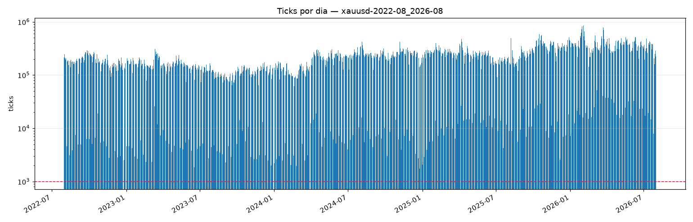

# Validação de `raw/` — xauusd-2022-08_2026-08

> Gerado por `research/lib/validate.py`. Nenhum número aqui é estimativa:
> todos saíram da leitura do dado.

| Campo | Valor |
|---|---|
| Linhas | 240,344,662 |
| Primeiro tick | 2022-08-01 00:00:00.143000+00:00 |
| Último tick | 2026-07-31 20:59:02.882000+00:00 |
| Dias com dado | 1245 |

## Defeitos

| Verificação | Ocorrências | Gravidade |
|---|---|---|
| Linhas idênticas duplicadas | 0 | remover em `curated/` |
| `ts` repetido (mesmo ms) | 0 | normal em feed de tick |
| `ts` retrocedendo | 0 | **estrutural** |
| `ask < bid` | 0 | **estrutural** |
| Preço ≤ 0 | 0 | **estrutural** |

## Cobertura

Feriados de mercado previstos pelo calendário no período: **12**.
Serão removidos de `curated/` (ADR 0006). `raw/` os mantém — é imutável.

### 4 dia(s) útil(eis) sem nenhum tick

- **4** explicados pelo calendário (fechamento total)
- **0** sem explicação

```
2023-04-07  Sexta-feira Santa
2024-03-29  Sexta-feira Santa
2025-04-18  Sexta-feira Santa
2026-04-03  Sexta-feira Santa
```

### 8 dia(s) anormalmente magro(s)

Abaixo de 20% da mediana do **mesmo dia da semana**, ou do piso
absoluto de 1,000 ticks. A comparação é por dia da semana porque o
domingo tem sessão parcial e roda uma ordem de grandeza abaixo de um pregão —
um limiar único ou cega a verificação ou condena todo domingo.

**8** explicados pelo calendário, **0** sem explicação.

| Dia | Ticks | Mediana do dia da semana | Motivo | Calendário |
|---|---|---|---|---|
| 2022-12-26 | 2,505 | 208,485 | 1% da mediana de Monday | Natal |
| 2023-01-02 | 4,650 | 208,485 | 2% da mediana de Monday | Ano-Novo |
| 2023-12-25 | 1,993 | 208,485 | 1% da mediana de Monday | Natal |
| 2024-01-01 | 2,220 | 208,485 | 1% da mediana de Monday | Ano-Novo |
| 2024-12-25 | 1,754 | 219,334 | 1% da mediana de Wednesday | Natal |
| 2025-01-01 | 2,093 | 219,334 | 1% da mediana de Wednesday | Ano-Novo |
| 2025-12-25 | 9,779 | 224,895 | 4% da mediana de Thursday | Natal |
| 2026-01-01 | 7,245 | 224,895 | 3% da mediana de Thursday | Ano-Novo |

## Ticks por dia



## Veredicto

**Sem defeito estrutural.**

**Toda ausência tem causa de calendário.**

Ausência de defeito estrutural não é atestado de qualidade do dado. Diz apenas
que o arquivo é internamente consistente; se ele representa o mercado é outra
pergunta, e quem responde é a medição do gap de fonte (`CLAUDE.md` §11.2).