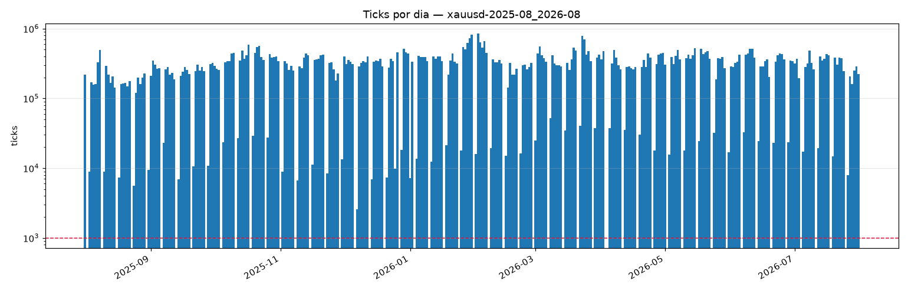

# Validação de `raw/` — xauusd-2025-08_2026-08

> Gerado por `research/lib/validate.py`. Nenhum número aqui é estimativa:
> todos saíram da leitura do dado.

| Campo | Valor |
|---|---|
| Linhas | 91,480,835 |
| Primeiro tick | 2025-08-01 00:00:00+00:00 |
| Último tick | 2026-07-31 20:59:02.882000+00:00 |
| Dias com dado | 312 |

## Defeitos

| Verificação | Ocorrências | Gravidade |
|---|---|---|
| Linhas idênticas duplicadas | 0 | remover em `curated/` |
| `ts` repetido (mesmo ms) | 0 | normal em feed de tick |
| `ts` retrocedendo | 0 | **estrutural** |
| `ask < bid` | 0 | **estrutural** |
| Preço ≤ 0 | 0 | **estrutural** |

## Cobertura — 1 dia(s) útil(eis) sem nenhum tick

**Não é veredicto, é pergunta.** Um destes é feriado de mercado, e nesse caso a
ausência é o dado correto: o ouro não negocia na Sexta-feira Santa, no Natal nem
no Ano-Novo. Outro é buraco de coleta, e aí contamina em silêncio qualquer bloco
in-sample que o contenha. Os dois se parecem aqui; separá-los é decisão de quem
monta o teste, e precisa ser tomada olhando a lista, não ignorando-a.

```
2026-04-03
```

## Ticks por dia



## Veredicto

**Sem defeito estrutural.**

Ausência de defeito estrutural não é atestado de qualidade do dado. Diz apenas
que o arquivo é internamente consistente; se ele representa o mercado é outra
pergunta, e quem responde é a medição do gap de fonte (`CLAUDE.md` §11.2).